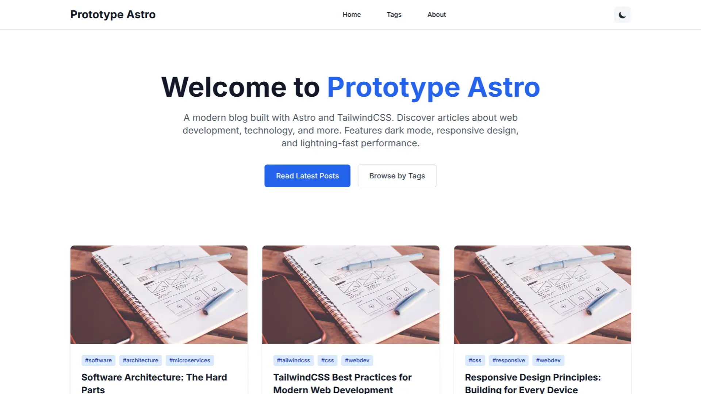

<div align="center">
  <a href="https://github.com/tyronejosee/prototype_astro#gh-light-mode-only" target="_blank">
    
  </a>
  <a href="https://github.com/tyronejosee/prototype_astro#gh-dark-mode-only" target="_blank">
    
  </a>
</div>
<div align="center">
  <h1><strong>Prototype Astro</strong></h1>
  <a href="https://prototype-astro.vercel.app/"><strong>Deploy on Vercel</strong></a>
</div>
<p align="center">
Prototype for a modern blog built with Astro and TailwindCSS, featuring markdown support, dark mode, responsive design, and tag-based post organization.
<p>

<p align="center">
  <a href="https://nodejs.org/">
    
  </a>
  <a href="https://astro.build/">
    
  </a>
  <a href="https://tailwindcss.com/">
    
  </a>
  <a href="https://www.typescriptlang.org/">
    
  </a>
  <a href="https://vercel.com/">
    
  </a>
</p>



## ✨ Features

- 🚀 **Astro 5** for superior performance.
- 🎨 **TailwindCSS** for fast and consistent styling.
- 🌙 **Dark mode** with system preference detection and persistent storage.
- 📝 **Dynamic blog** with support for tags, pagination, and post previews.
- 🔍 **SEO optimized** (Open Graph, Twitter Cards, meta tags).
- 📱 **Responsive design** that adapts to mobile, tablets, and desktops.
- ⚡ **Hybrid rendering** (component islands for interactivity).

## ✅ Requirements

- [Node.js](https://nodejs.org/) >= 18
- [pnpm](https://pnpm.io/) or npm/yarn

## ⚙️ Installation

Clone this repository and enter the directory.

```bash
git clone git@github.com:tyronejosee/prototype_astro.git
cd prototype_astro
````

Install dependencies.

```bash
pnpm install
```

Start the development server.

```bash
pnpm dev
```

Generate a production build.

```bash
pnpm build
```

Preview the build.

```bash
pnpm preview
```

The development server will open at [http://localhost:4321](http://localhost:4321).

## 📖 Included Pages

- `/` → Home with paginated post listing.
- `/blog/[slug]` → Single post view.
- `/tags` → List of all tags.
- `/about` → Information about the project.
- `/404` → Custom error page.

## 🌟 Contributions

Contributions are welcome!
You can open an *issue* or a *pull request* in this repository.

## ⚖️ License

This prototype is under the [MIT license](./LICENSE).

Enjoy! 🎉
